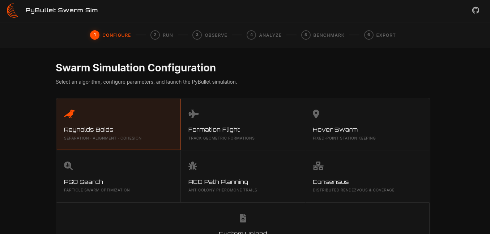
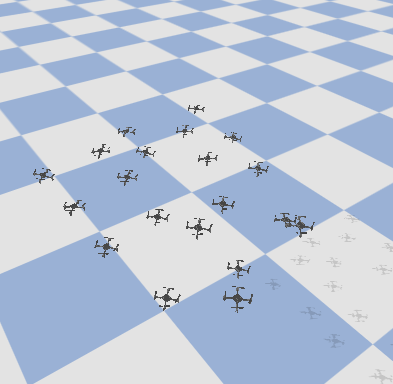
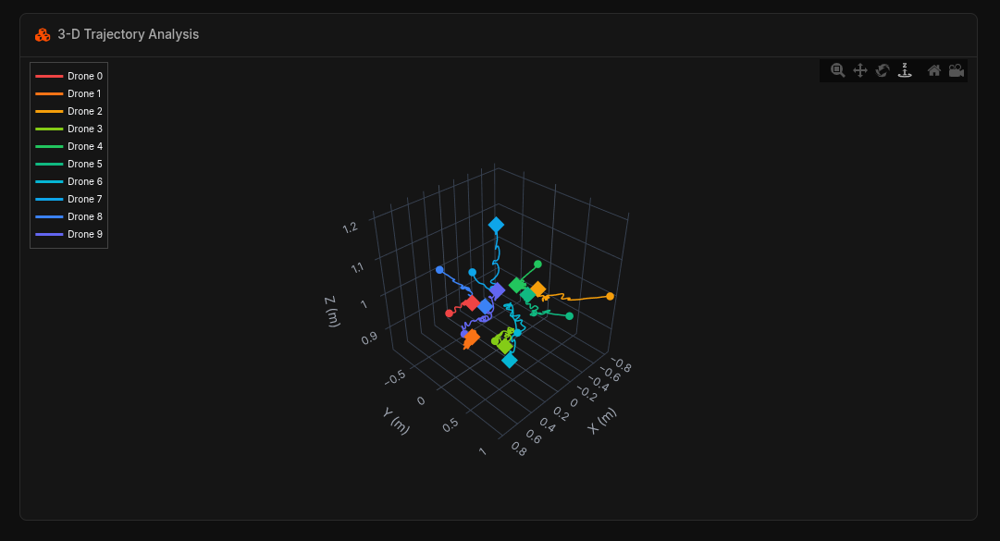
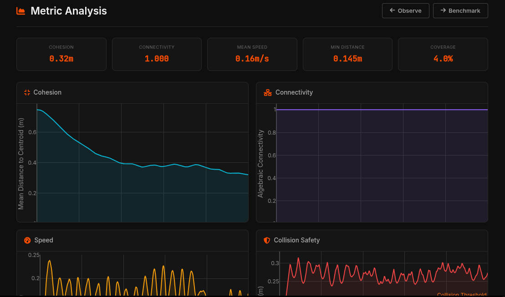
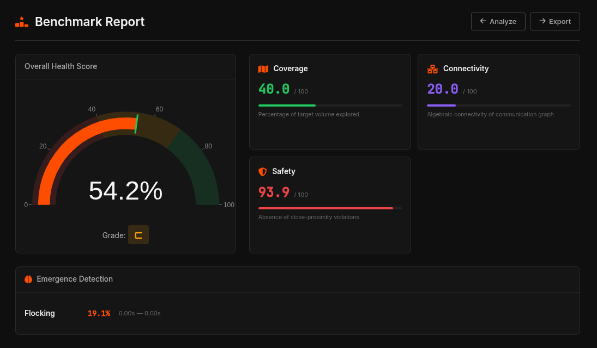
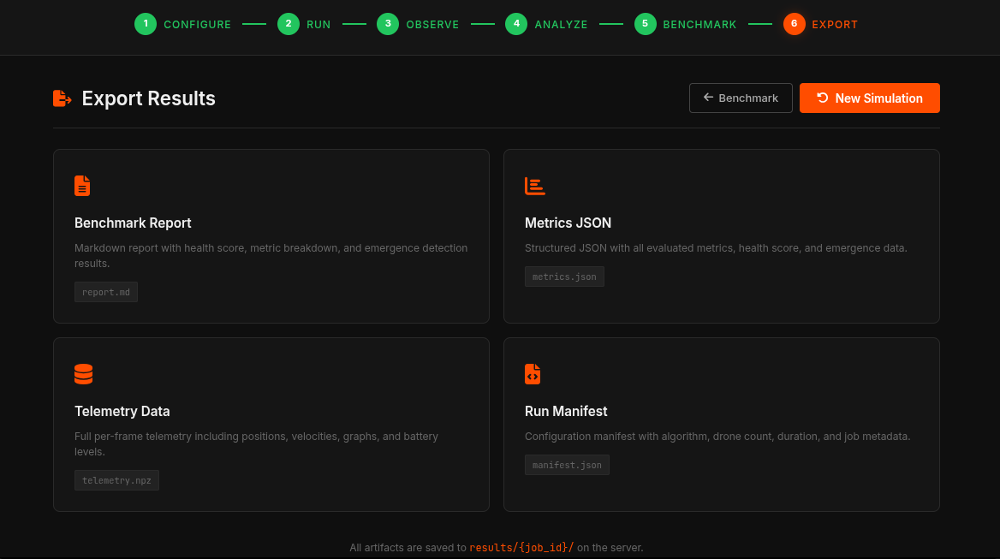

<p align="center">
  
  
  
  
  
</p>

<h1 align="center">PyBullet Swarm Sim</h1>

<p align="center">
  A modular, physics-accurate Python framework for multi-drone swarm simulation.<br>
</p>

---

## Overview

PyBullet Swarm Sim provides a full-stack environment for simulating and evaluating multi-drone swarm behavior. It combines rigid-body physics simulation via PyBullet, Gymnasium-compatible environments, a suite of classical swarm intelligence algorithms, and a real-time web dashboard for interactive benchmarking and trajectory visualization.
The framework is designed to be minimal in setup and maximal in capability — researchers can go from installation to a running swarm in minutes, while the architecture supports extension to custom physics models, algorithms, and RL policies.

---

## Features

| Category | Description |
|:---|:---|
| **Environments** | Gymnasium-compatible environments for hover, formation flight, single-agent RL, and multi-agent RL |
| **Agents** | Cascaded PID controller and Stable-Baselines3 RL agent wrapper |
| **10 Algorithms** | Boids, PSO, ACO, Consensus, Formation, Hover, APF, Artificial Bee Colony, Voronoi Coverage, MARL (PPO) |
| **Physics** | Rigid body dynamics, ground effect, aerodynamic drag, rotor downwash |
| **Telemetry** | Per-step state logging with structured frame capture and NPZ export |
| **Evaluation** | Benchmark suite with emergence metrics, health scoring, and JSON reports |
| **Comparison** | Algorithm comparison mode with interactive Plotly radar charts across runs |
| **Battle Mode** | Competitive swarm vs swarm simulation with kinetic elimination mechanics and live scoring |
| **Web Dashboard** | FastAPI + Plotly interactive dashboard with scenario presets, run history, and MARL training UI |

---

## Demo

| Configure | Run | Observe |
|:---:|:---:|:---:|
|  |  |  |
| **Analyze** | **Benchmark** | **Export** |
|  |  |  |

---

## Installation

### From PyPI

```bash
pip install pybullet-swarm-sim
```

### From Source

```bash
git clone https://github.com/pybullet-swarm-sim/pybullet-swarm-sim.git
cd pybullet-swarm-sim
pip install -e .
```

### Optional Extras

```bash
# RL training support (Stable-Baselines3 + PyTorch)
pip install -e ".[rl]"

# Web dashboard (FastAPI + Uvicorn + Plotly)
pip install -e ".[dashboard]"

# Development tooling (pytest, ruff, black)
pip install -e ".[dev]"
```

---

## Quick Start

```python
import swarm_sim
import numpy as np

env = swarm_sim.make("HoverSwarm-v0", num_drones=4, gui=True)
obs, info = env.reset()

for _ in range(1000):
    action = np.full((4, 4), env.HOVER_RPM)
    obs, reward, terminated, truncated, info = env.step(action)

env.close()
```

---

## Web Dashboard

The dashboard provides a browser-based interface for the complete simulation workflow (Configure → Run → Observe → Analyze → Benchmark → Export) — no code required.

**Launch:**

```bash
python -m swarm_sim.dashboard
```

The server starts on `http://127.0.0.1:8000` and the browser opens automatically.

**Capabilities:**

- Select from **10 swarm algorithms** with visual algorithm cards and one-click scenario presets
- Configure drone count (5–100) and simulation duration via slider controls
- Stream real-time simulation progress and logs over Server-Sent Events
- Upload a custom algorithm `.py` file and run it directly against the benchmark suite
- **Run History Sidebar** — revisit and replay past simulation results
- **Algorithm Comparison Mode** — select multiple completed runs and generate interactive Plotly radar charts overlaying Coverage, Cohesion, Connectivity, and Safety metrics
- **Battle Mode** — pitch two different algorithms against each other in a kinetic elimination arena with a live scoreboard, kill feed, and post-battle combat analytics
- **MARL Training Panel** — train multi-agent PPO policies directly from the UI with live progress tracking, then deploy them in simulation
- View interactive 3D trajectory plots (per-drone, color-coded) powered by Plotly
- Review structured benchmark reports including health score, emergence metrics, and per-algorithm KPIs
- Export results as JSON, Markdown reports, and telemetry NPZ archives

---

## Battle Mode

The platform features a competitive **Battle Mode** where two distinct swarm algorithms are pitched against each other in a kinetic elimination arena. 

- **Combat Mechanics:** Eliminations occur via speed-based collisions (kinetic impact). Faster, aggressive drones eliminate slower ones on contact.
- **Algorithm Integrity:** Algorithms run their native patterns (e.g., Boids charge in formation, PSO converges on the enemy). The runner directs their target vectors toward the opposition.
- **Live UI:** The dashboard features a real-time 2D arena canvas, live scoreboard, and a streaming kill feed.
- **Analytics:** Post-battle results include K/D ratios, survival rates, battle intensity, and Plotly charts mapping kills over time.

**Run a headless battle via CLI:**

```bash
python -m swarm_sim.battle.runner \
    --algo-alpha flocking --algo-bravo pso \
    --drones-alpha 10 --drones-bravo 10 \
    --duration 20 --job-id battle-demo
```

---

## Command-Line Examples

All examples run headlessly via the PyBullet GUI. No config files required.

**Formation Flight — V-shape, 8 drones:**

```bash
python -m swarm_sim.examples.formation_flight --n-drones 8 --formation v
```

**Boids Flocking — 12 drones:**

```bash
python -m swarm_sim.examples.flocking --n-drones 12
```

**Hover Swarm — sanity check, 4 drones:**

```bash
python -m swarm_sim.examples.hover_swarm --n-drones 4
```

**RL Training — PPO hover policy (single-agent):**

```bash
pip install pybullet-swarm-sim[rl]
python -m swarm_sim.examples.rl_hover --train --timesteps 100000
python -m swarm_sim.examples.rl_hover --play --model-path ppo_hover
```

**MARL Training — Multi-agent PPO (parameter-sharing):**

```bash
python -m swarm_sim.training.marl_train --drones 5 --timesteps 50000
```

---

## Swarm Algorithms

All algorithms implement the `BaseAlgorithm` interface and return `(N, 3)` velocity targets via `compute(state)`.

| # | Algorithm | Module | Key Behavior |
|:--|:----------|:-------|:-------------|
| 1 | **Reynolds Boids** | `flocking.py` | Separation · Alignment · Cohesion |
| 2 | **Formation Flight** | `formation.py` | Geometric shapes (Line, V, Grid, Ring, Helix) |
| 3 | **Hover Swarm** | _via env_ | Fixed-point station keeping |
| 4 | **PSO Search** | `pso.py` | Particle Swarm Optimization with global best |
| 5 | **ACO Path Planning** | `aco.py` | Ant Colony pheromone trail waypoints |
| 6 | **Consensus** | `consensus.py` | Distributed rendezvous & coverage |
| 7 | **Artificial Potential Fields** | `apf.py` | Goal attraction + obstacle/peer repulsion |
| 8 | **Artificial Bee Colony** | `abc.py` | Employed / Onlooker / Scout foraging dynamics |
| 9 | **Voronoi Coverage** | `voronoi_coverage.py` | Lloyd's algorithm for spatial dispersion |
| 10 | **MARL (PPO)** | `marl.py` | Multi-agent RL with parameter-sharing PPO |

### Usage Examples

```python
# Reynolds Boids
from swarm_sim.algorithms.flocking import FlockingAlgorithm
flock = FlockingAlgorithm(num_drones=10, r_separation=0.3)
velocity_targets = flock.compute(state)

# Artificial Potential Fields
from swarm_sim.algorithms.apf import APFAlgorithm
apf = APFAlgorithm(num_drones=8, k_att=0.5, k_rep=2.0)
velocity_targets = apf.compute(state)

# Voronoi Coverage
from swarm_sim.algorithms.voronoi_coverage import VoronoiCoverageAlgorithm
voronoi = VoronoiCoverageAlgorithm(num_drones=12)
velocity_targets = voronoi.compute(state)

# MARL (with trained model)
from swarm_sim.algorithms.marl import MARLAlgorithm
marl = MARLAlgorithm(num_drones=5, model_path="models/marl_ppo_5d.zip")
velocity_targets = marl.compute(state)

# Particle Swarm Optimization
from swarm_sim.algorithms.pso import PSOAlgorithm
pso = PSOAlgorithm(num_drones=10, w=0.7, c1=1.5, c2=1.5)
velocity_targets = pso.compute(state)

# Formation Planner
from swarm_sim.algorithms.formation import FormationPlanner
from swarm_sim.utils.enums import FormationType
planner = FormationPlanner()
offsets = planner.compute_offsets(FormationType.HELIX, num_drones=10, spacing=0.5)
```

---

## Architecture

```
pybullet-swarm-sim/
├── swarm_sim/
│   ├── envs/                    # Gymnasium environments
│   │   ├── base_swarm_env.py    # Core: PyBullet physics + multi-drone step loop
│   │   ├── hover_swarm_env.py   # Fixed-point station keeping
│   │   ├── formation_env.py     # Moving formation tracking
│   │   ├── rl_swarm_env.py      # Normalized obs/actions for SB3 (single-agent)
│   │   └── marl_env.py          # Multi-agent RL env with parameter sharing
│   ├── agents/                  # Per-drone controllers
│   │   ├── base_agent.py        # Abstract controller interface
│   │   ├── pid_agent.py         # Cascaded PID: position → attitude → RPM
│   │   └── rl_agent.py          # Stable-Baselines3 policy wrapper
│   ├── algorithms/              # Swarm intelligence (10 algorithms)
│   │   ├── flocking.py          # Reynolds Boids
│   │   ├── formation.py         # Geometric formation planner
│   │   ├── consensus.py         # Distributed rendezvous and coverage
│   │   ├── pso.py               # Particle Swarm Optimization
│   │   ├── aco.py               # Ant Colony Optimization
│   │   ├── apf.py               # Artificial Potential Fields
│   │   ├── abc.py               # Artificial Bee Colony
│   │   ├── voronoi_coverage.py  # Lloyd's algorithm Voronoi tessellation
│   │   └── marl.py              # Multi-agent RL (PPO inference + heuristic fallback)
│   ├── training/                # RL training scripts
│   │   └── marl_train.py        # MARL PPO trainer with dashboard progress streaming
│   ├── dashboard/               # Web interface
│   │   ├── __main__.py          # Entry point: launches Uvicorn server
│   │   ├── server.py            # FastAPI routes, SSE streaming, comparison, MARL endpoints
│   │   ├── runner.py            # Subprocess simulation runner with telemetry
│   │   └── static/              # Frontend assets (HTML/CSS/JS)
│   ├── telemetry/               # Structured per-step state logging
│   │   ├── frame.py             # TelemetryFrame data structure
│   │   └── telemetry.py         # TelemetryLogger: NPZ export + manifest
│   ├── evaluation/              # Benchmark evaluation and reporting
│   │   ├── emergence.py         # Emergence and collective behavior metrics
│   │   ├── metrics/             # Modular per-algorithm metric definitions
│   │   └── report.py            # BenchmarkReporter: health scoring, JSON output
│   ├── events/                  # Simulation event logging
│   │   └── base.py              # EventLogger: timestamped event records
│   ├── testing/                 # Benchmark harnesses
│   │   └── benchmarks/          # CoverageBenchmark, FormationBenchmark
│   ├── core/                    # Shared state primitives
│   │   └── state.py             # SwarmState data container
│   ├── utils/                   # Enumerations, plotting helpers
│   └── assets/                  # URDF drone models (CF2X, CF2P)
├── models/                      # Trained RL model checkpoints (.zip)
├── tests/                       # Pytest suite
├── pyproject.toml
└── README.md
```

---

## Environments

| Environment | Description | Primary Use |
|:---|:---|:---|
| `BaseSwarm-v0` | Raw multi-drone physics | Custom controllers |
| `HoverSwarm-v0` | Hover at fixed target positions | PID baseline, benchmarking |
| `Formation-v0` | Track a moving geometric formation | Coordination research |
| `RLSwarm-v0` | Normalized observations and actions | Single-agent reinforcement learning |
| `MARLSwarm-v0` | Ego-centric obs, parameter-sharing | Multi-agent reinforcement learning |

---

## Physics Modes

| Mode | Description |
|:---|:---|
| `PYB` | Base rigid-body dynamics |
| `PYB_GND` | + Ground effect |
| `PYB_DRAG` | + Aerodynamic drag |
| `PYB_DW` | + Rotor downwash |
| `PYB_GND_DRAG_DW` | All effects combined (most realistic) |

---

## Drone Models

| Model | Mass | Configuration |
|:---|:---|:---|
| `CF2X` | 27 g | Crazyflie 2.x — X motor layout |
| `CF2P` | 27 g | Crazyflie 2.x — Plus motor layout |

---

## Formation Shapes

`LINE` · `V` · `GRID` · `RING` · `HELIX`

---

## Testing

```bash
pip install -e ".[dev]"
pytest tests/ -v
```

---

## Custom Algorithm Integration

The dashboard supports runtime upload of custom algorithm `.py` files. Any class implementing a `compute(state)` method that accepts a `SwarmState` and returns velocity targets is compatible.

```python
from swarm_sim.algorithms.base_algorithm import BaseAlgorithm

class MyAlgorithm(BaseAlgorithm):
    def compute(self, state):
        # state.positions: (N, 3) array of drone positions
        # state.velocities: (N, 3) array of drone velocities
        # return: (N, 3) velocity targets
        ...
```

Upload the file via the dashboard UI and it runs immediately against the benchmark harness.

---

## Contributing

Contributions are welcome. See [CONTRIBUTING.md](CONTRIBUTING.md) for:

- Development environment setup
- Code style guidelines (Black + Ruff, line length 100)
- How to add new swarm algorithms
- How to add new drone URDF models

---

## License

MIT — see [LICENSE](LICENSE).

---

<p align="center">
  If this project is useful to your work, consider giving it a star.
</p>
